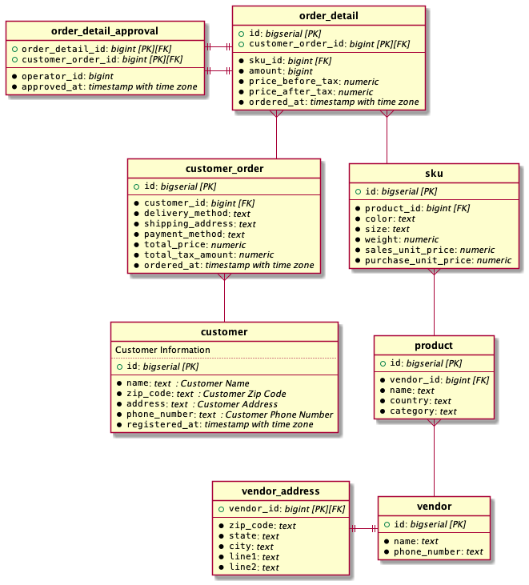

# planter

[](https://travis-ci.org/achiku/planter)
[](https://raw.githubusercontent.com/achiku/planter/master/LICENSE)
[](https://goreportcard.com/report/github.com/achiku/planter)

Generate PlantUML ER diagram textual description from PostgreSQL tables


## Why created

A team with only software engineers doesn't need ER diagram that much as long as they have decent experience in Relational Database modeling. However, it becomes very helpful to have always-up-to-date ER diagram when marketing/promotion/operation teams consisting of those who are fluent in writing/reading SQL, join to the game.

[PlantUML](http://plantuml.com/) supports ER diagram in the latest version with [this awesome pull request](https://github.com/plantuml/plantuml/pull/31). The tool, planter, generates textual description of PlantUML ER diagram from pre-existing PostgreSQL tables, and makes it easy to share visual structure of relations with other teams.


## Installation

```
go get -u github.com/achiku/planter
```

## Quick Start

```
$ planter postgres://planter@localhost/planter?sslmode=disable -o example.uml
$ java -jar plantuml.jar -verbose example.uml
```




## Specify table names

```
planter postgres://planter@localhost/planter?sslmode=disable \ 
    -t order_detail \
    -t sku \
    -t product
```


## Help

```
$ planter --help
usage: planter [<flags>] <conn>

Flags:
      --help             Show context-sensitive help (also try --help-long and --help-man).
  -s, --schema="public"  PostgreSQL schema name
  -o, --output=OUTPUT    output file path
  -t, --table=TABLE ...  target tables (can handle regular expressions)
  -x, --xtable=TABLE ... exclude target tables (can handle regular expressions

Args:
  <conn>  PostgreSQL connection string in URL format
```


## Test

setup database.

```
create database planter;
create user planter;
```

run `go test ./... -v`
